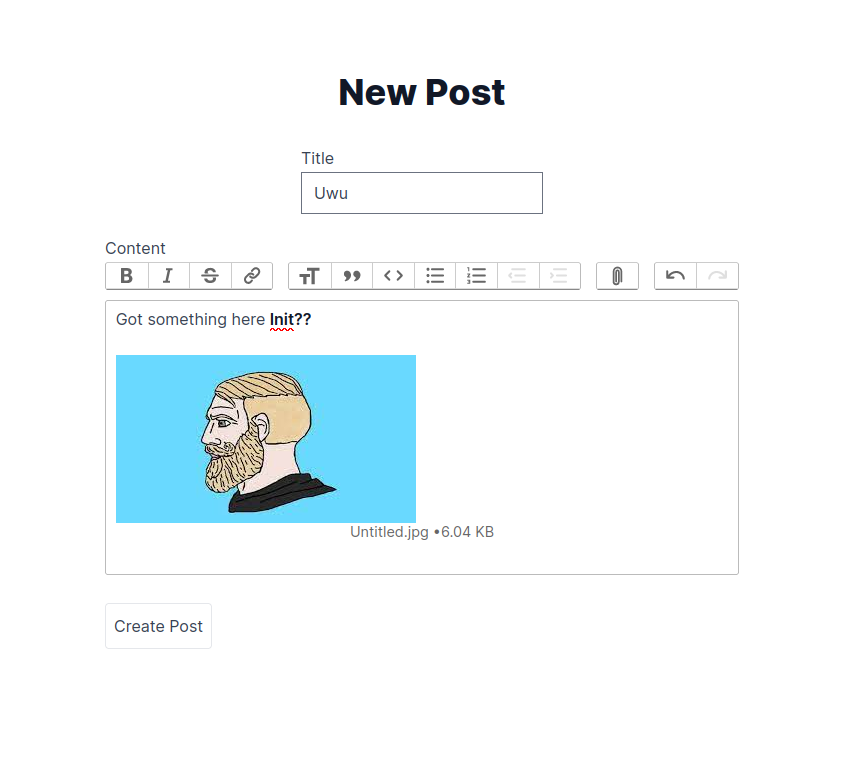
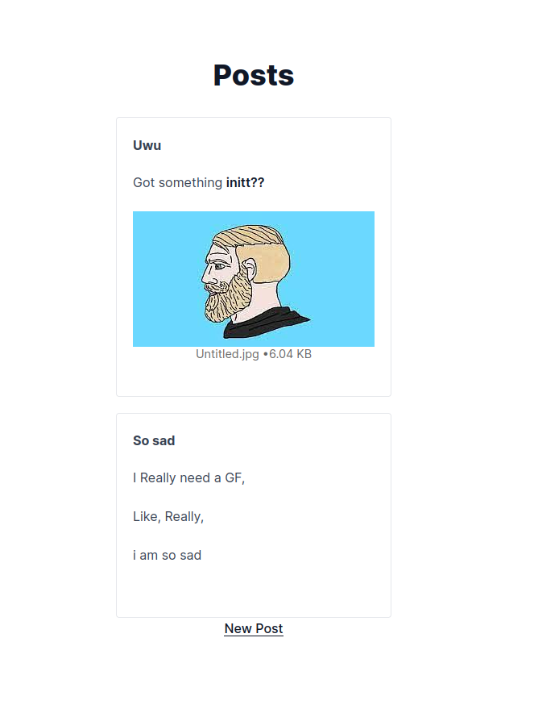

# Rich Text Editor

Just a simple web app to test some features of Rails Action Text.





## Description

The whole application runs on Puma web server, make shure to have the right
version of ruby and rails installed.

Action Text also allows us to upload/save files, at the moment it only saves
locally, so if you want to save on another service like amazon S3, it should
require some configuration.


It provides basic features like a post and read them all at the main screen.

## Specs

* Ruby version 3.3.0
* Rails version 7.1.3.4

* System dependencies 
    - libvips
    - ffmpeg
    - SQLite

* Gem dependencies
```sh
bundle install
```

* Database creation
```sh
rails db:create
```

* Database initialization
```sh
rails db:migrate
```

* Start server
```sh
rails server 
```

The application should be running on http://localhost:3000

